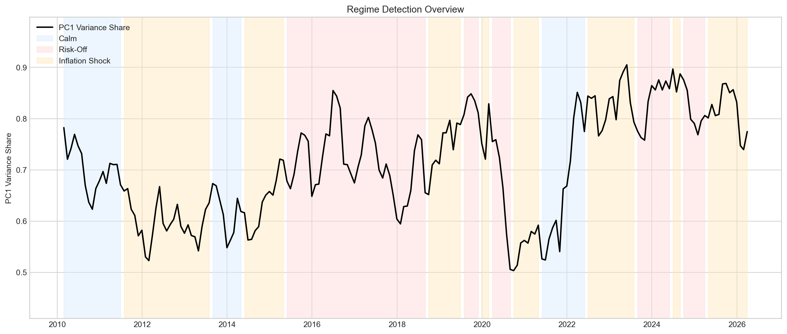
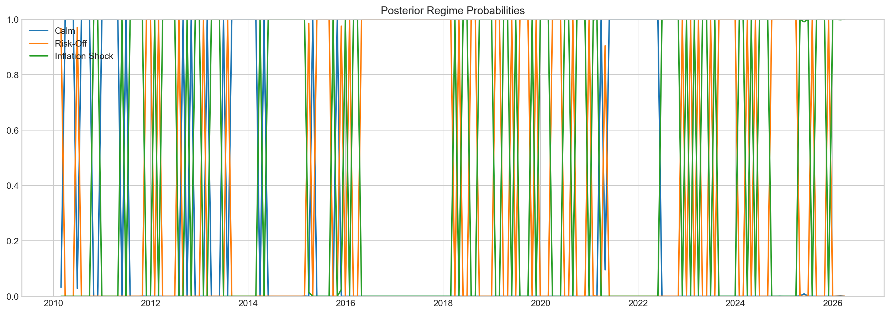
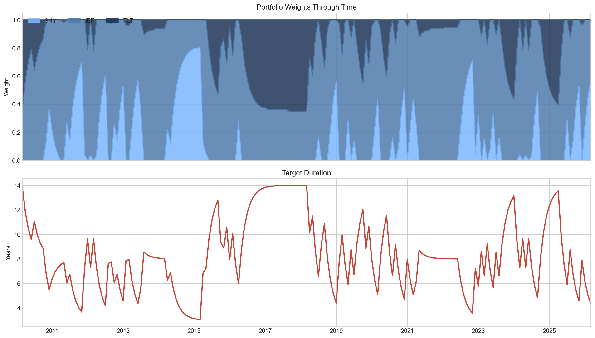
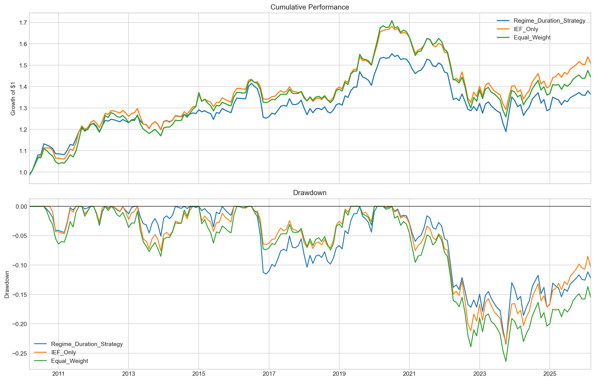

# Regime-Based Duration Strategy

This project builds a fixed income allocation strategy that detects bond market regimes with a rolling Hidden Markov Model and adjusts portfolio duration through `SHY`, `IEF`, and `TLT`.

## Project Idea

The core hypothesis is that duration exposure should not be static. When rate volatility, credit conditions, and macro inflation signals shift, the portfolio should adapt its target duration instead of holding a fixed Treasury allocation.

## Method

1. Download U.S. Treasury yields, macro variables, and ETF prices.
2. Extract a monthly curve-stress feature from rolling PCA on daily yield changes.
3. Build a macro feature set using VIX, credit spread, yield spread, and inflation.
4. Estimate hidden market regimes with a rolling 3-state Gaussian HMM.
5. Convert regime probabilities into target duration.
6. Map target duration into ETF weights across `SHY`, `IEF`, and `TLT`.
7. Compare the strategy against simple bond benchmarks.

## Regime Interpretation

- `Calm`: moderate duration stance
- `Risk-Off`: long duration tilt
- `Inflation Shock`: short duration tilt

## Repository Structure

- `regmie_develop.ipynb`: main portfolio notebook for presentation
- `regime_portfolio_pipeline.py`: reusable research and backtest pipeline
- `regime_portfolio_pipeline.ipynb`: compact walkthrough notebook
- `requirements.txt`: Python dependencies

## Outputs

The notebook includes:

- regime timeline and posterior probabilities
- regime-wise feature distributions
- portfolio weight and target duration history
- cumulative performance and drawdown charts
- regime-level return diagnostics

## README Figures

After running the notebook or script, you can export static PNG files for GitHub with:

```python
from regime_portfolio_pipeline import PipelineConfig, export_readme_figures, run_pipeline

results = run_pipeline(PipelineConfig())
export_readme_figures(results)
```

This saves images into `figures/`, which can then be embedded in the README.

Recommended figures:

- `figures/regime_overview.png`
- `figures/regime_probabilities.png`
- `figures/strategy_weights.png`
- `figures/backtest_dashboard.png`

### Regime Overview



### Posterior Probabilities



### Portfolio Positioning



### Backtest Dashboard



## Setup

Install packages:

```bash
pip install -r requirements.txt
```

Add your FRED API key to [`.env`](/Users/2ys/Desktop/KSIF/SAA/전략/regime%20project/.env):

```bash
FRED_API_KEY=your_key_here
```

## Run

For the portfolio presentation version, open [ `regmie_develop.ipynb` ](/Users/2ys/Desktop/KSIF/SAA/전략/regime%20project/regmie_develop.ipynb) and run the cells from top to bottom.

To run the script version:

```bash
python regime_portfolio_pipeline.py
```
